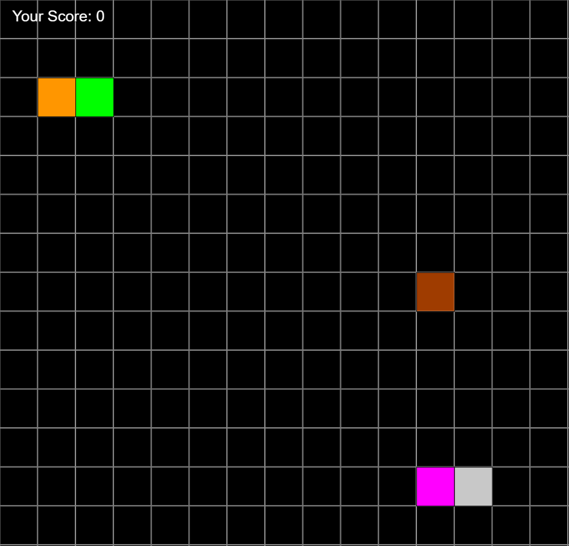

# Snake 2.0: Robot Apocalypse
The snake returns, but with several new challenges to face, such as competition at his own game. This time, a robot snake would like to help itself to a couple hundreds of apples as well. This robot also has the ability to cheat by doing things that the original snake cannot, such as bumping into itself.
To make matters even worse, the apples start to decay within a time limit. Right when the snake is about to eat an apple, it could decay into nothing, with a new apple entirely somewhere else on the screen. Can you guide the poor snake to defeating the robot at consuming apples?

** Pink and gray is robot snake
 
 
